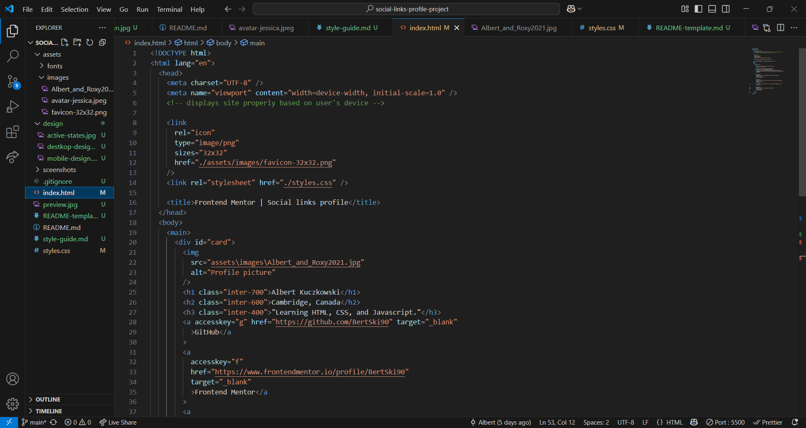
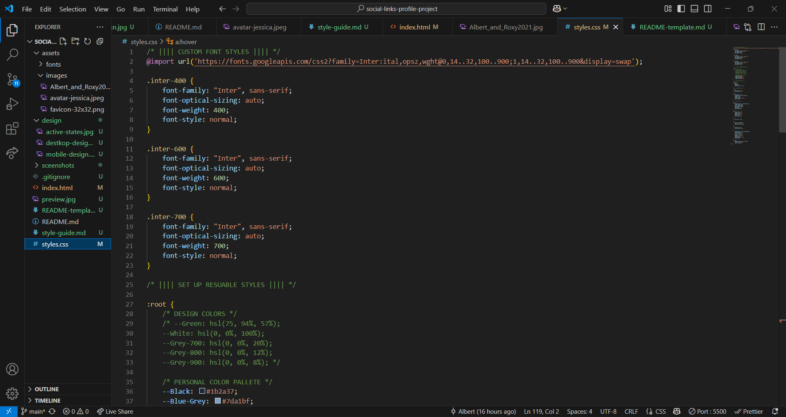
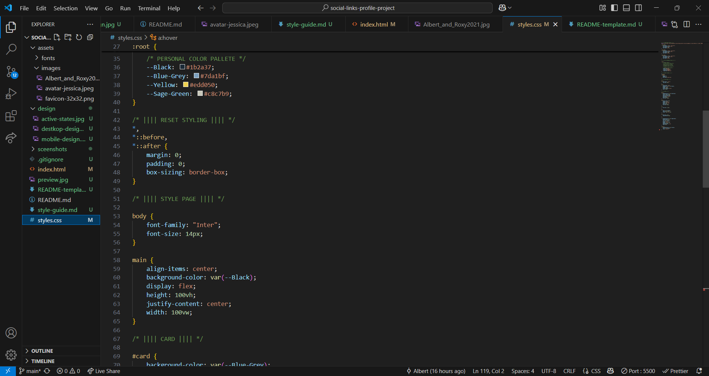
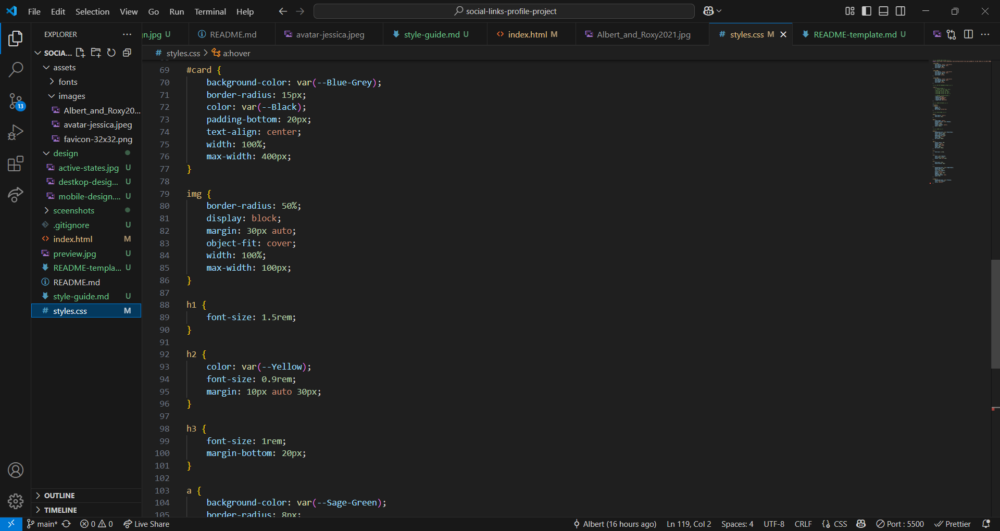
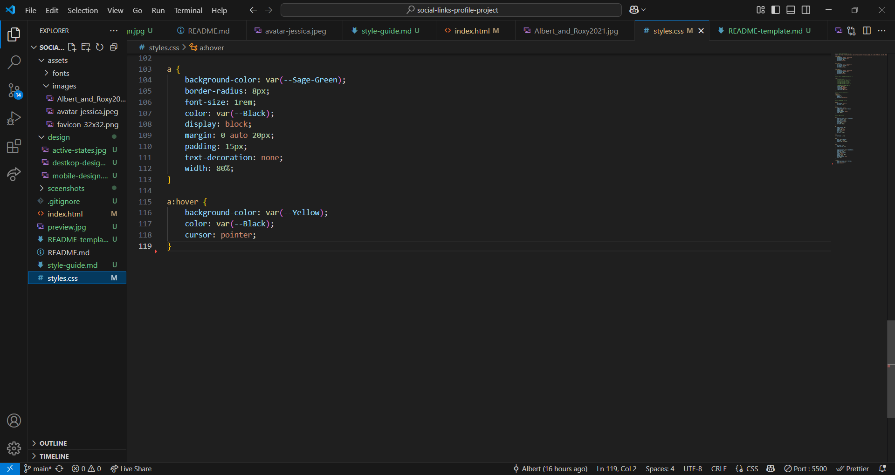

# Frontend Mentor - Social links profile solution

This is a solution to the [Social links profile challenge on Frontend Mentor](https://www.frontendmentor.io/challenges/social-links-profile-UG32l9m6dQ). Frontend Mentor challenges help you improve your coding skills by building realistic projects.

## Table of contents

- [Overview](#overview)
  - [The challenge](#the-challenge)
  - [Screenshot](#screenshot)
  - [Links](#links)
- [My process](#my-process)
  - [Built with](#built-with)
  - [What I learned](#what-i-learned)
  - [Continued development](#continued-development)
  - [Useful resources](#useful-resources)
- [Author](#author)
- [Acknowledgments](#acknowledgments)

## Overview

### The challenge

Users should be able to:

- See hover and focus states for all interactive elements on the page
- Use accesskey of f, g, l, c, and t to browse the links.

### Screenshot

HTML


CSS





### Links

- Solution URL: [Github @BertSki90](https://github.com/BertSki90/social-links-profile-project)
- Live Site URL: [Github Pages @BertSki90](https://bertski90.github.io/social-links-profile-project/)

## My process

### Built with

- Semantic HTML5 markup
- CSS custom properties
- Flexbox
- Mobile-first workflow

### What I learned

I learned about the HTML property "accesskey=". Which enables the user to make a selection with the keyboard. See below:

```html
<a
  accesskey="f"
  href="https://www.frontendmentor.io/profile/BertSki90"
  target="_blank"
  >Frontend Mentor</a
>
```

### Continued development

I learnt about the "accesskey=" property in HTML. I am getting more comfortable working with images and in general CSS. It is exciting to learn more properties to make my code more appealing and useful.

### Useful resources

- [MDN Web Docs](https://developer.mozilla.org/en-US/docs/Web/HTML/Reference/Global_attributes/accesskey) - A great guide on how to setup access keys to html so that user is able to make a selection using the keyboard.

## Author

- Website - [GitHub Pages @BertSki90](https://github.com/BertSki90)
- Frontend Mentor - [@BertSki90](https://www.frontendmentor.io/profile/BertSki90)
- Twitter - [@BertSki90](https://x.com/BertSki90)

## Acknowledgments

Thank to freeCodeCamp for making it easier to get access to outstanding quality of learning about code! Thank you to Frontend Mentor for giving me a place to practice what I have learnt and expand on that!
